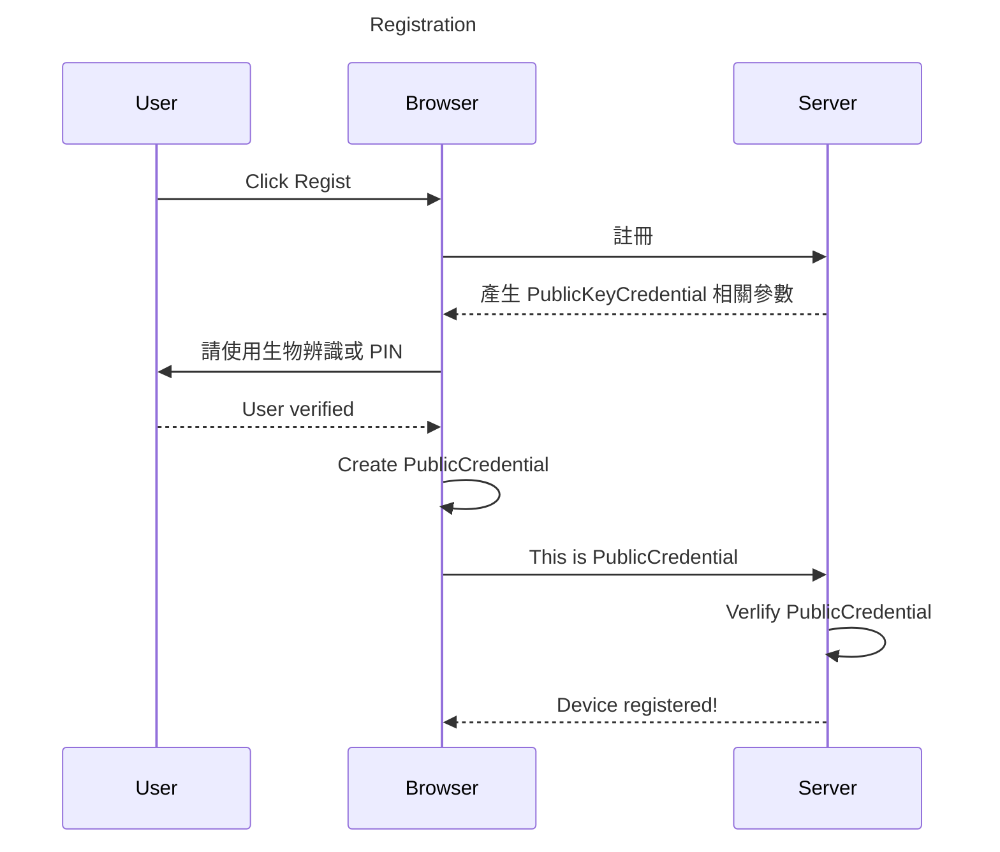
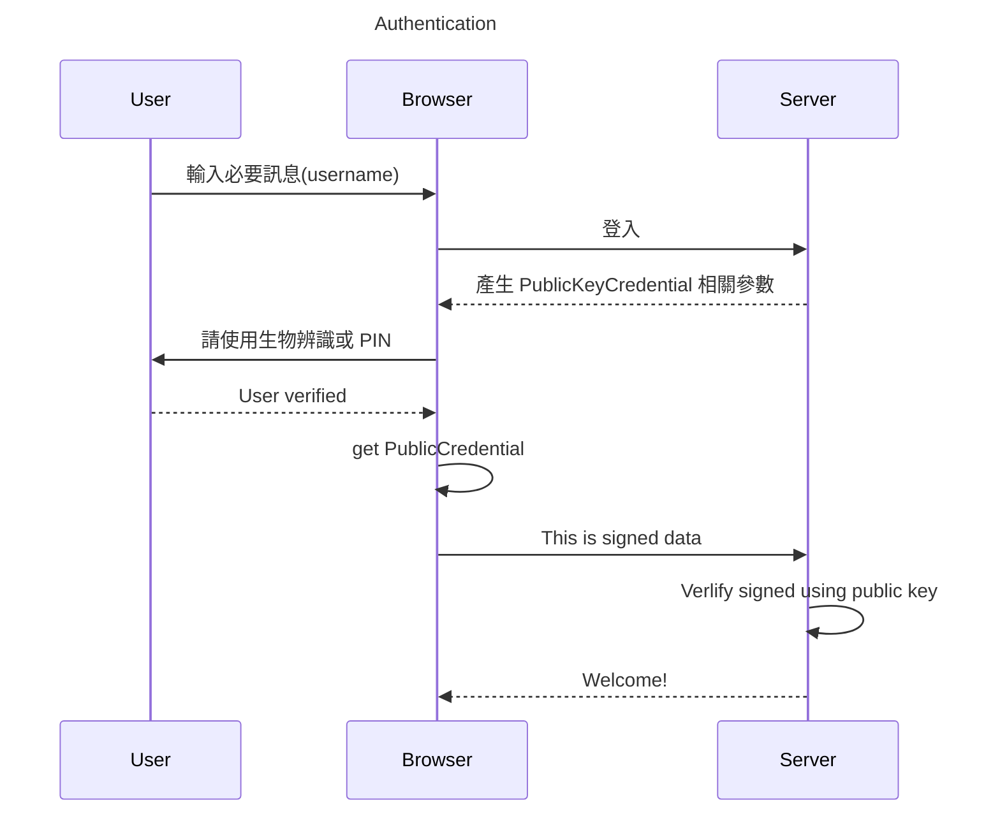

# WebAuthn Demo
> WebAuthn 無密碼登入實做練習


### 流程
**註冊**


**登入**


### Feature
- [ ] 將 WebAuthn 功能模組化
- [ ] 後端驗證功能研究並實作

### Usage

**Client**
```
pnpm install

pnpm dev
```

**Server**
```
pnpm install

pnpm dev
```

**Docker**
```
docker-compose up -d
```

**Docker(tls)**
1. 準備憑證(mkcert)
    - **serve-spa.localhost**
2. 將憑證放入根目錄 **.certs**
    - 名稱對應 **docker/dynamic_conf.yaml** 內的設定名稱
```
docker-compose -f docker-compose-tls.yml up -d
```