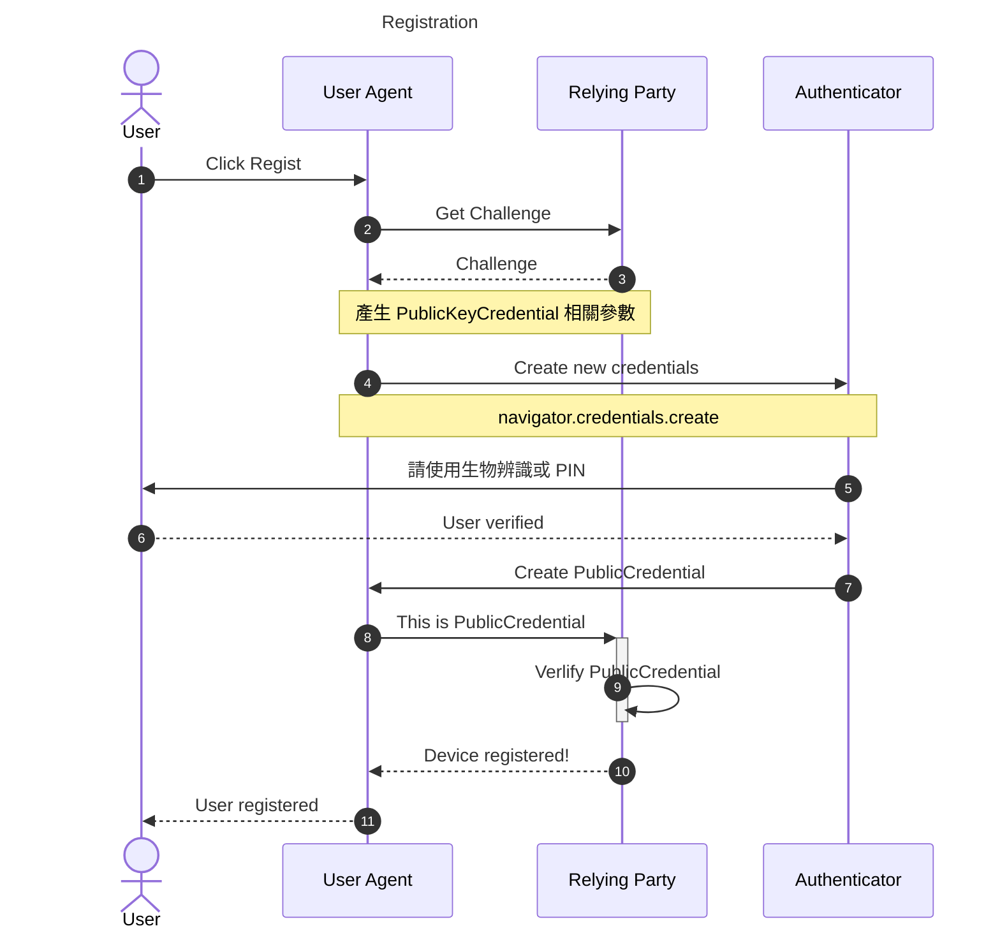
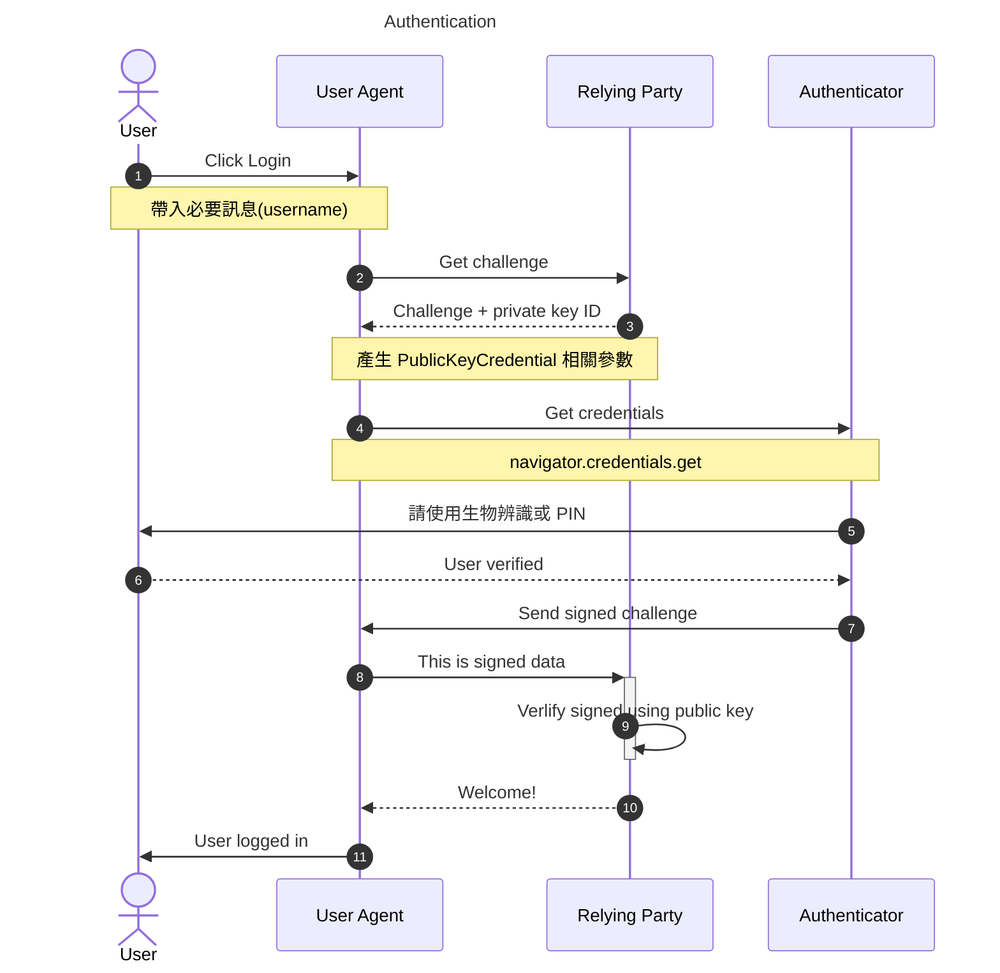
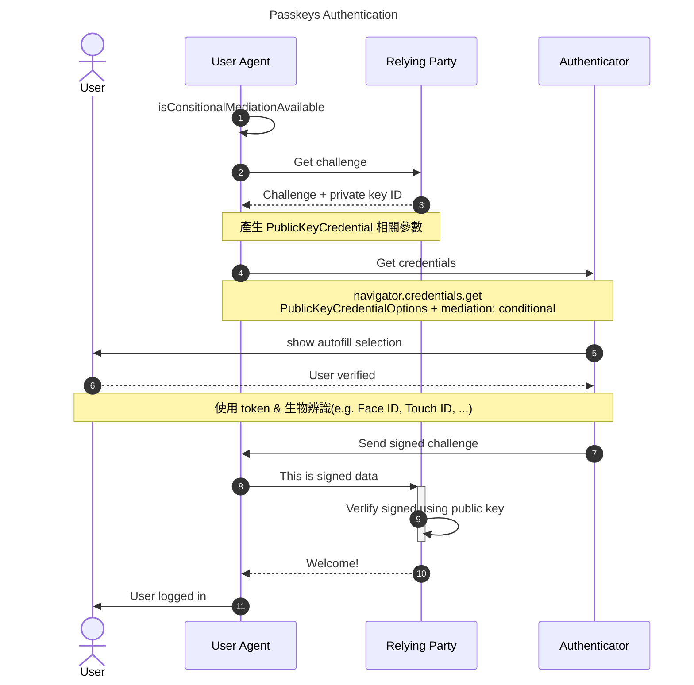

# WebAuthn Demo

> WebAuthn 無密碼登入實做練習

### 流程

**註冊**



**登入**



**PassKeys**



### Feature

- [x] 將 WebAuthn 功能模組化
- [x] 調整為 Monorepo 資料夾結構
- [ ] 後端驗證功能研究並實作
- [ ] 新增 mongodb 支援
- [x] Dockerlize

### Usage

**Client**

```
pnpm install

pnpm passless-client dev
```

**Server**

```
pnpm install

pnpm passless-server dev
```

**Docker**

1. 準備憑證
   - **webauthn.localhost**
2. 將憑證放入根目錄 **.certs**
   - 名稱對應 **docker/dynamic_conf.yaml** 內的設定名稱

```
docker compose up -d
```
